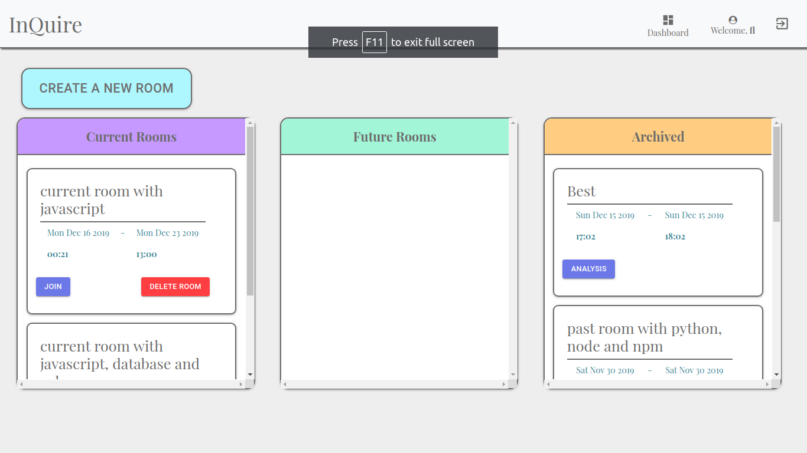
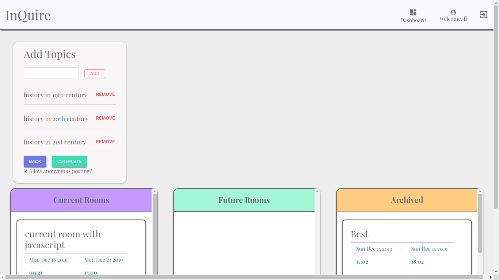
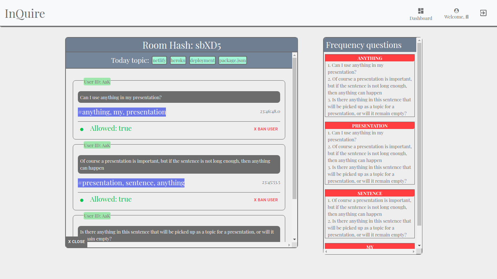
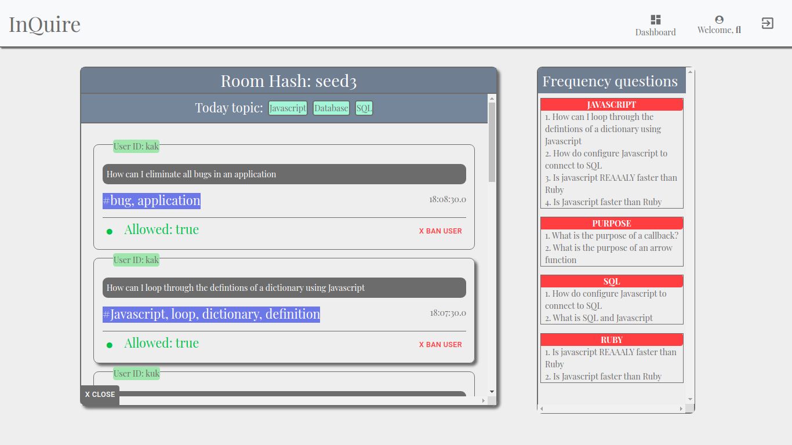
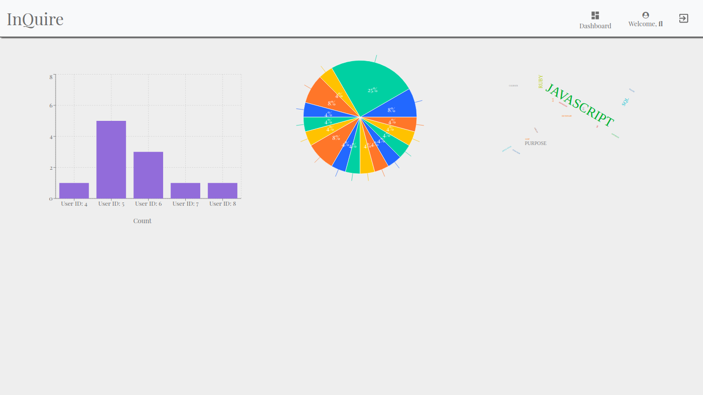
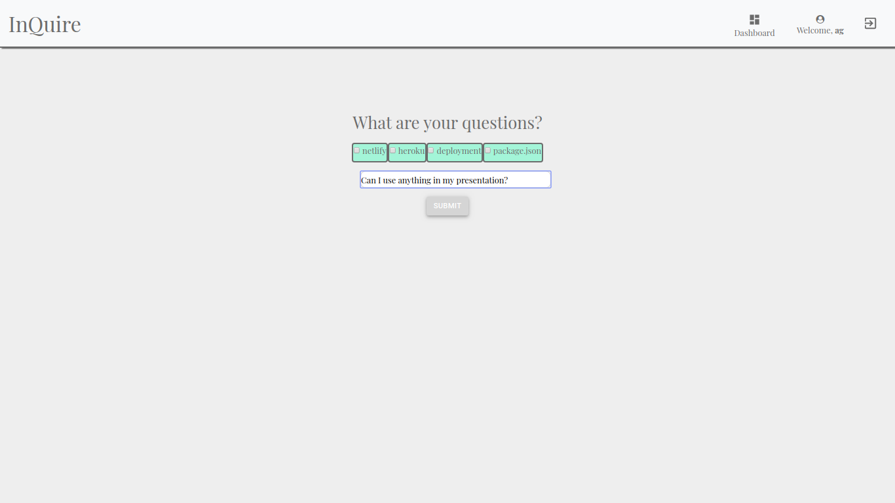

##### This project was bootstrapped with [Create React App](https://github.com/facebook/create-react-app).

# InQuire

### Client-Side - Main

This is the client-side and the main repository for the InQuire project. Server-side code is available [here](https://github.com/lxg1992/LHL-Final-Server
)


### Online Instance
There is a demo of this application hosted on Netlify pinging a Heroku server over here:

https://hungry-varahamihira-549516.netlify.com/

It takes up to a minute to restart the Heroku instance that serves the back-end to this project

> If you encounter a "no such resource on this server" error then simply remove the trailing slashes after the default url

## Motivation

The team behind the project are all students from universities. We've all had an experience of sitting in an auditorium with 300 students with a burning question but being unable to ask it due to:

* The professor not accepting questions during the lecture

  Which would lead to all the information presented onward to be rendered less useful as the foundational knowledge was not cemented properly

* Social anxiety/speech impediment/poor language communication skills

  All too common, especially as immigrants coming to a country with a different primary language, the discomfort of standing in front of an auditorium and speaking can be paralyzing. 

* Reputation/uncertainty of the validity of the question

  And finally, the simplest and the silliest reason of them all. We simply don't know if the question we are asking is "bad" and we don't want to seem like a person who is not informed in front of the whole audience. 

## Solution

  ### Host

  
  

  As a professor/instructor/host, you may not allow for questions to be asked which would disrupt the flow of information, but nevertheless, it is important to know where the classroom stands in regards to the topic/information presented. 

You will not know the individuals asking the questions, but you will know if it is the same individual asking several questions by their unique guest hash that is randomly generated for each unique room (and if you deem their questions inappropriate then you can promptly ban them from participating in the room)




After each room session is finished, you have access to the analytical product of that specific room. You can see the classroom participation as well as various analytical datae related to the room in examination



Ideally you will have the software running in the classroom/online teaching room on a monitor that is not seen by the audience. It will be there only as your feedback system.

Depending on the size of the classroom or the prevalence of certain questions being asked in high concentration, you can decide whether to explain something more in depth during the lecture, or make a note of a lot of questions being asked during a particular time of the lecture/seminar/presentation, prompting for a better explanation of the topic.

  ### Client


The application allows you to ask questions in a semi-anonymous manner (or fully anonymous if you are using the anonymous user, if the host created the room with appropriate rules) 

You can either select the tags that are provided by the host when generating a room, or type your question as is, and the integrated NLP system will detect the topics of interest by hand.



## Stack

### Back-end

* Express API
* Knex query system
* PostgresQL
* Heroku deployment
* Heroku-Postgres provisioned database


### Front-end

* React
* D3
* compromise (natural language processing)
* Material UI
* Netlify deployment


## Installation

### Server
In order to use this application locally, you must install PostgreSQL on your local machine.

The application assumes you use port 5432 (default) for your installation of the database.

Create a user ```final``` with password of ```final``` 

With that user being the owner of the database, create the database ```final```

Assuming you have both the client and the server repositories cloned on your machine, navigate to the server repository in your terminal/command-line-prompt and type ```npm install```  

You may attempt to run the server with ```npm start``` or ```npm run start```

Navigating to localhost:3001 in your browser should give you the following message as JSON:

```{"message": "No resource at this route, try /users, /rooms, /guests, /questions" }```

As of this point, you should not be able to see anything if you hit /users or other routes, it will return an empty array ```[]```


Within the root directory of the server, in your terminal type command ```npm run reset```

This will create the tables and seed some data into them

If you navigate to ```localhost:3001/users``` in your browser, you should see some users generated in a JSON format. If you do not see them, something went wrong.

### Client

If you have not cloned this repository, do so now.

Within the repository on your local machine, at the root level run ```npm install``` in the terminal

After it is finished, type ```npm run start```

You can attempt to login with a user ```fl@email.com``` with password ```fl``` (that's FL in lower case)

Your application is now set up


